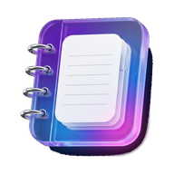
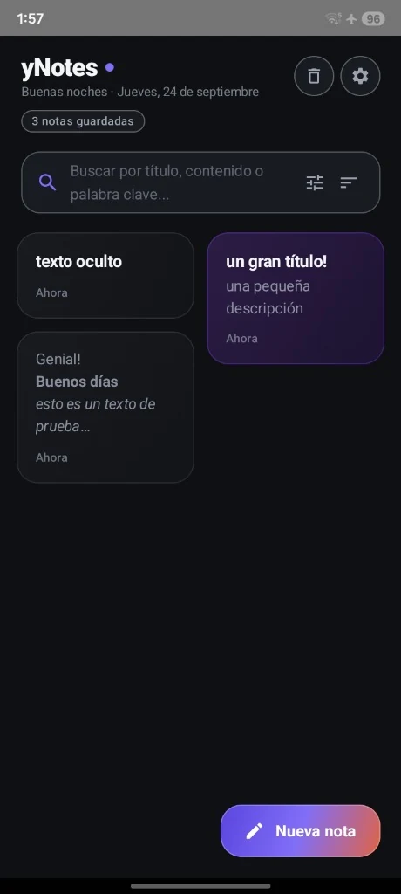
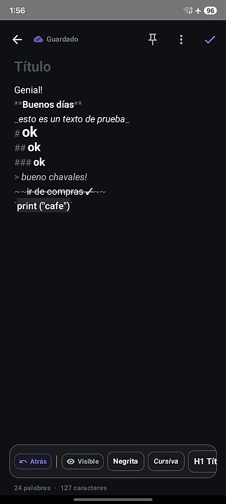
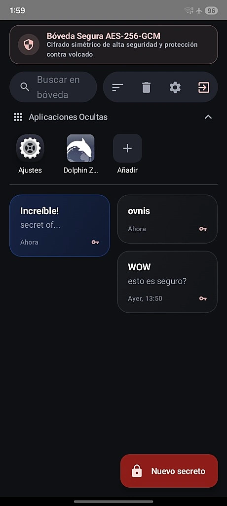
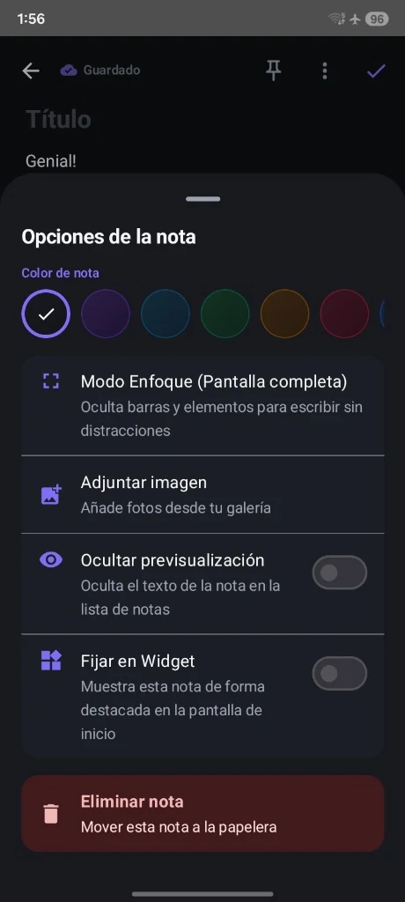
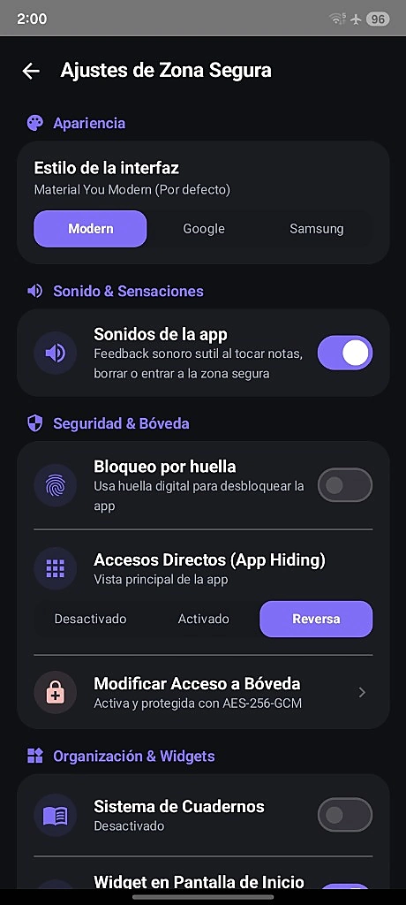

<div align="center">

  

  # yNotes

  **Una App de Notas Simple, Rápida, Confiable y Cómoda!**  
  *Tus notas diarias, listas y apuntes en Markdown con fluidez, widgets y Bóveda Cifrada AES-256*

  <p>
    <a href="https://github.com/uamo11/ynotes/blob/main/LICENSE"></a>
    <a href="https://github.com/uamo11/ynotes/releases/latest"></a>
    
    
    
  </p>

  <h3>
    <a href="https://uamo11.github.io/ynotes/">🌐 Visitar Sitio Web Oficial (GitHub Pages)</a>
    <span> · </span>
    <a href="https://github.com/uamo11/ynotes/releases/latest">📦 Descargar APK Directo</a>
    <span> · </span>
    <a href="PRIVACY_POLICY.md">🛡️ Política de Privacidad</a>
  </h3>

</div>

---

## 📖 Acerca de yNotes

**yNotes** es una aplicación nativa para Android construida desde cero con **Jetpack Compose** y **Kotlin**. Su propósito principal es ofrecerte la mejor experiencia para escribir, organizar y consultar tus notas de todos los días: una herramienta **simple, rápida, confiable y cómoda**.

Cuenta con un editor Markdown ágil en vivo, widgets para la pantalla de inicio, categorización visual por notas de colores y modo enfoque sin distracciones. Además, para aquellos pensamientos, contraseñas o datos íntimos que requieran un nivel superior de protección, incorpora una **Bóveda Segura** blindada con cifrado simétrico por hardware **AES-256-GCM**, operando 100% fuera de línea sin rastreadores ni publicidad.

---

## 📱 Capturas de Pantalla

<div align="center">
  <table>
    <tr>
      <td align="center" width="33%">
        <strong>Pantalla Principal</strong><br/><br/>
        
      </td>
      <td align="center" width="33%">
        <strong>Editor Markdown</strong><br/><br/>
        
      </td>
      <td align="center" width="33%">
        <strong>Bóveda Segura AES-256</strong><br/><br/>
        
      </td>
    </tr>
    <tr>
      <td align="center" width="33%">
        <strong>Opciones y Modo Enfoque</strong><br/><br/>
        
      </td>
      <td align="center" width="33%">
        <strong>Ajustes y Zona Segura</strong><br/><br/>
        
      </td>
      <td align="center" width="33%">
        <strong>Identidad Visual</strong><br/><br/>
        <p>🎨 <em>Colores cálidos, interfaz AMOLED pura, soporte Material You y sensaciones hápticas cuidadas.</em></p>
      </td>
    </tr>
  </table>
</div>

---

## ✨ Características Principales

- 📝 **Editor Markdown en Vivo**: Formato enriquecido rápido con barra de herramientas integrada: negrita, cursiva, encabezados (`# H1`, `## H2`, `### H3`), citas textuales, tachado y bloques de código monoespaciado.
- 📊 **Contador de Palabras y Caracteres**: Monitorización en tiempo real de la longitud de tus textos.
- 🔐 **Bóveda Segura (AES-256-GCM)**: Espacio cifrado de máxima seguridad protegido por contraseña o huella dactilar para guardar notas confidenciales.
- 🕵️ **Camuflaje y App Hiding**: Disfraza el acceso a tu bóveda con iconos y accesos directos señuelo para proteger tu intimidad ante miradas curiosas.
- 🎨 **Temas de Interfaz Versátiles**: Cambia entre tres estilos visuales completos:
  - *Material You Modern* (predeterminado).
  - *Estilo Google Notes*.
  - *Estilo Samsung Notes*.
- 🏷️ **Paleta de Colores por Nota**: Categoriza visualmente tus apuntes con colores sutiles adaptados a modo claro y oscuro.
- 🧘 **Modo Enfoque (Pantalla Completa)**: Oculta barras de estado y menús para redactar sin ninguna distracción.
- 👁️ **Ocultar Previsualización en Lista**: Oculta el cuerpo del texto en el feed principal para que solo tú veas el contenido al abrir la nota.
- 📌 **Widgets de Pantalla de Inicio**: Fija recordatorios y notas indispensables directamente en el launcher de Android.
- 🔊 **Feedback Sensorial Suave**: Respuesta sonora y háptica discreta al interactuar, guardar o acceder a la zona segura.

---

## 🛡️ Enfoque de Privacidad y Seguridad

La privacidad en yNotes no es una opción de configuración: es el cimiento sobre el que está diseñada:

1. **Cero Conexión a Internet**: La aplicación no declara el permiso `android.permission.INTERNET`. Es técnicamente imposible que transmita datos a servidores remotos.
2. **Cifrado por Hardware (Android Keystore)**: Las llaves criptográficas de la Bóveda Segura se generan y custodian dentro del procesador seguro (TEE / StrongBox) del dispositivo.
3. **Autenticación Biométrica Segura**: Integración con la API oficial `BiometricPrompt`. yNotes jamás accede ni guarda tus datos biométricos.
4. **Almacenamiento Local Aislado**: Tus notas y configuraciones se almacenan exclusivamente en el sandbox privado de la aplicación (`EncryptedSharedPreferences` y base de datos local).
5. **Sin Puertas Traseras**: No existen mecanismos de recuperación remota ni cuentas en la nube. La custodia de tus notas te pertenece al 100%.

Para más detalles, consulta la [Política de Privacidad completa](PRIVACY_POLICY.md).

---

## 📥 Instalación y Descarga

### Opción 1: APK Directo (GitHub Releases)
1. Ve a la sección de **[Releases Oficiales](https://github.com/uamo11/ynotes/releases/latest)**.
2. Descarga el archivo `yNotes-release.apk` (o nombre de versión correspondiente).
3. Abre el archivo en tu dispositivo Android. Si el sistema te lo solicita, activa *"Instalar aplicaciones de fuentes desconocidas"* para tu navegador o gestor de archivos.
4. Completa la instalación y disfruta de yNotes.

### Opción 2: F-Droid (En proceso)
El repositorio cuenta con la receta oficial [`metadata/app.uamo.ynotes.yml`](metadata/app.uamo.ynotes.yml) y estructura Fastlane lista para el catálogo libre de [F-Droid](https://f-droid.org/). Consulta [`FDROID_SUBMISSION.md`](FDROID_SUBMISSION.md) para más detalles.

---

## 🛠️ Tecnologías y Arquitectura

- **Lenguaje**: Kotlin
- **UI Toolkit**: Jetpack Compose (Material Design 3 / Material You)
- **Criptografía**: AndroidX Security Crypto (AES-256-GCM + Android Keystore)
- **Biometría**: AndroidX Biometric API
- **Arquitectura**: MVVM limpia y reactiva con StateFlow / Coroutines
- **Compilación CI/CD**: Automatizada mediante GitHub Actions

---

## 🤝 Contribuir

¡Las contribuciones son bienvenidas! Si deseas reportar un error, sugerir una función o enviar un Pull Request:

1. Haz un Fork del repositorio.
2. Crea una rama para tu función (`git checkout -b feature/nueva-funcion`).
3. Confirma tus cambios (`git commit -m 'Añade nueva función'`).
4. Haz push a la rama (`git push origin feature/nueva-funcion`).
5. Abre un Pull Request describiendo tus modificaciones.

> [!NOTE]
> <!-- TODO: Añadir directrices específicas de contribución si se crea CONTRIBUTING.md -->
> Por favor, asegúrate de mantener el principio fundamental de cero dependencias con rastreadores y cero llamadas de red externas.

---

## 📄 Licencia

Este proyecto está distribuido bajo la licencia libre **MIT**. Consulta el archivo [LICENSE](LICENSE) para más información.

```text
Copyright (c) 2026 yNotes
Licensed under the MIT License.
```

---

## 🌐 Enlaces del Proyecto

- **Sitio Web Oficial**: [https://uamo11.github.io/ynotes/](https://uamo11.github.io/ynotes/)
- **Repositorio de Código**: [https://github.com/uamo11/ynotes](https://github.com/uamo11/ynotes)
- **Seguimiento de Incidencias**: [https://github.com/uamo11/ynotes/issues](https://github.com/uamo11/ynotes/issues)
- **Política de Privacidad**: [PRIVACY_POLICY.md](PRIVACY_POLICY.md)
